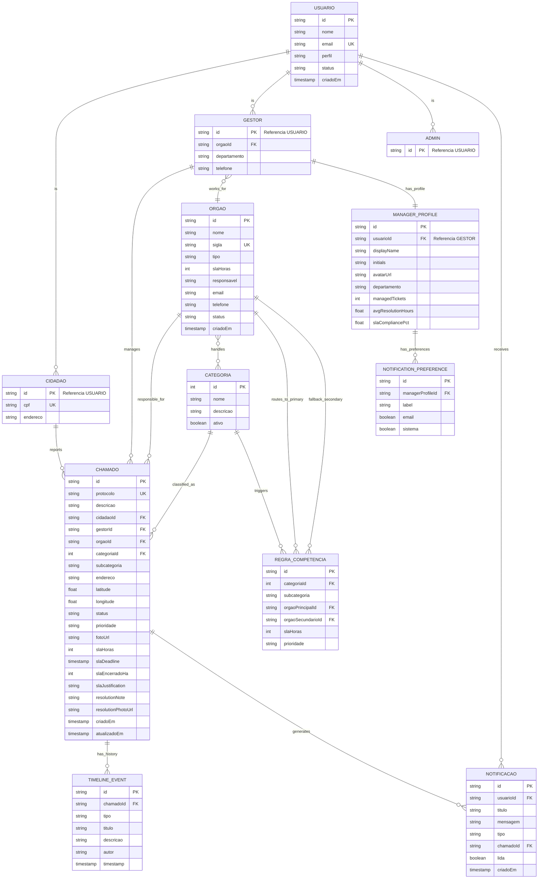

# Modelo Lógico - Diagrama de Entidade-Relacionamento
## Sistema de Gerenciamento de Chamados Públicos (Prefeitura)

---

## 📊 Diagrama ER Detalhado (Mermaid.js)



---

## 📋 Especificação do Modelo Lógico

### **Tabela: USUARIO (Generalização)**

| Coluna | Tipo | Constraints | Descrição |
|--------|------|-------------|-----------|
| `id` | VARCHAR(36) | PK, NOT NULL | UUID v4 |
| `nome` | VARCHAR(150) | NOT NULL | Nome completo |
| `email` | VARCHAR(100) | UNIQUE, NOT NULL | E-mail de login |
| `perfil` | ENUM('Cidadão','Gestor','Admin') | NOT NULL | Papel no sistema |
| `status` | ENUM('Ativo','Inativo') | NOT NULL, DEFAULT='Ativo' | Estado do usuário |
| `criadoEm` | TIMESTAMP | NOT NULL, DEFAULT=CURRENT_TIMESTAMP | Data de criação |

**Chave Primária**: `id`
**Índices**: `email` (UNIQUE)

---

### **Tabela: CIDADAO (Especialização de USUARIO)**

| Coluna | Tipo | Constraints | Descrição |
|--------|------|-------------|-----------|
| `id` | VARCHAR(36) | PK, FK(USUARIO.id), NOT NULL | Referência ao usuário |
| `cpf` | VARCHAR(11) | UNIQUE, NULL | CPF (opcional) |
| `endereco` | VARCHAR(255) | NULL | Endereço residencial |

**Chave Primária**: `id`
**Chaves Estrangeiras**: `id` → `USUARIO.id` (ON DELETE CASCADE)
**Índices**: `cpf` (UNIQUE)

---

### **Tabela: GESTOR (Especialização de USUARIO)**

| Coluna | Tipo | Constraints | Descrição |
|--------|------|-------------|-----------|
| `id` | VARCHAR(36) | PK, FK(USUARIO.id), NOT NULL | Referência ao usuário |
| `orgaoId` | VARCHAR(36) | FK(ORGAO.id), NOT NULL | Órgão de vinculação |
| `departamento` | VARCHAR(100) | NULL | Setor/departamento |
| `telefone` | VARCHAR(20) | NULL | Telefone corporativo |

**Chave Primária**: `id`
**Chaves Estrangeiras**: 
- `id` → `USUARIO.id` (ON DELETE CASCADE)
- `orgaoId` → `ORGAO.id` (ON DELETE RESTRICT)
**Índices**: `orgaoId`

---

### **Tabela: ADMIN (Especialização de USUARIO)**

| Coluna | Tipo | Constraints | Descrição |
|--------|------|-------------|-----------|
| `id` | VARCHAR(36) | PK, FK(USUARIO.id), NOT NULL | Referência ao usuário |

**Chave Primária**: `id`
**Chaves Estrangeiras**: `id` → `USUARIO.id` (ON DELETE CASCADE)

---

### **Tabela: ORGAO**

| Coluna | Tipo | Constraints | Descrição |
|--------|------|-------------|-----------|
| `id` | VARCHAR(10) | PK, NOT NULL | Sigla (ex: PMR) |
| `nome` | VARCHAR(200) | NOT NULL | Nome completo |
| `sigla` | VARCHAR(10) | UNIQUE, NOT NULL | Acrônimo |
| `tipo` | ENUM('Municipal','Estadual','Federal','Concessionária') | NOT NULL | Classificação |
| `slaHoras` | INTEGER | NOT NULL, CHECK > 0 | SLA padrão em horas |
| `responsavel` | VARCHAR(150) | NULL | Contato |
| `email` | VARCHAR(100) | NOT NULL | E-mail corporativo |
| `telefone` | VARCHAR(20) | NULL | Telefone |
| `status` | ENUM('Ativo','Inativo') | NOT NULL, DEFAULT='Ativo' | Estado |
| `criadoEm` | TIMESTAMP | NOT NULL, DEFAULT=CURRENT_TIMESTAMP | Data criação |

**Chave Primária**: `id`
**Índices**: 
- `sigla` (UNIQUE)
- `status`

---

### **Tabela: CATEGORIA**

| Coluna | Tipo | Constraints | Descrição |
|--------|------|-------------|-----------|
| `id` | INTEGER | PK, AUTO_INCREMENT | Identificador |
| `nome` | VARCHAR(100) | UNIQUE, NOT NULL | Nome da categoria |
| `descricao` | TEXT | NULL | Descrição detalhada |
| `ativo` | BOOLEAN | NOT NULL, DEFAULT=TRUE | Ativa/inativa |

**Chave Primária**: `id`
**Índices**: `nome` (UNIQUE), `ativo`

**Valores Padrão**:
1. Problemas na Via
2. Água e Esgoto
3. Iluminação Pública
4. Saneamento Básico
5. Sinalização
6. Outros Problemas

---

### **Tabela: REGRA_COMPETENCIA**

| Coluna | Tipo | Constraints | Descrição |
|--------|------|-------------|-----------|
| `id` | VARCHAR(36) | PK, NOT NULL | UUID v4 |
| `categoriaId` | INTEGER | FK(CATEGORIA.id), NOT NULL | Categoria trigger |
| `subcategoria` | VARCHAR(100) | NOT NULL | Subclassificação |
| `orgaoPrincipalId` | VARCHAR(10) | FK(ORGAO.id), NOT NULL | Órgão principal |
| `orgaoSecundarioId` | VARCHAR(10) | FK(ORGAO.id), NULL | Órgão fallback |
| `slaHoras` | INTEGER | NOT NULL, CHECK > 0 | SLA específico |
| `prioridade` | ENUM('Baixa','Média','Alta','Crítica') | NOT NULL | Prioridade padrão |

**Chave Primária**: `id`
**Chaves Estrangeiras**:
- `categoriaId` → `CATEGORIA.id` (ON DELETE RESTRICT)
- `orgaoPrincipalId` → `ORGAO.id` (ON DELETE RESTRICT)
- `orgaoSecundarioId` → `ORGAO.id` (ON DELETE SET NULL)
**Índices**: 
- UNIQUE(`categoriaId`, `subcategoria`)
- `orgaoPrincipalId`
- `orgaoSecundarioId`
**Constraint Check**: `orgaoPrincipalId <> orgaoSecundarioId`

---

### **Tabela: CHAMADO** (Central)

| Coluna | Tipo | Constraints | Descrição |
|--------|------|-------------|-----------|
| `id` | VARCHAR(36) | PK, NOT NULL | UUID v4 |
| `protocolo` | VARCHAR(20) | UNIQUE, NOT NULL | Número público |
| `descricao` | TEXT | NOT NULL, MAX 1000 | Descrição do problema |
| `cidadaoId` | VARCHAR(36) | FK(CIDADAO.id), NOT NULL | Quem reportou |
| `gestorId` | VARCHAR(36) | FK(GESTOR.id), NULL | Gestor atribuído |
| `orgaoId` | VARCHAR(10) | FK(ORGAO.id), NOT NULL | Órgão responsável |
| `categoriaId` | INTEGER | FK(CATEGORIA.id), NOT NULL | Classificação |
| `subcategoria` | VARCHAR(100) | NOT NULL | Subclassificação |
| `endereco` | VARCHAR(255) | NOT NULL | Localização |
| `latitude` | DECIMAL(10,8) | NOT NULL | Coordenada GPS |
| `longitude` | DECIMAL(11,8) | NOT NULL | Coordenada GPS |
| `status` | ENUM('Aberto','Em Análise','Em Andamento','Aguardando','Resolvido','Fechado') | NOT NULL, DEFAULT='Aberto' | Estado |
| `prioridade` | ENUM('Baixa','Média','Alta','Crítica') | NOT NULL | Urgência |
| `fotoUrl` | VARCHAR(500) | NULL | Foto do problema |
| `slaHoras` | INTEGER | NOT NULL, CHECK > 0 | Prazo em horas |
| `slaDeadline` | TIMESTAMP | NOT NULL | Data/hora limite |
| `slaEncerradoHa` | DECIMAL(8,2) | NULL | Horas de atraso |
| `slaJustification` | TEXT | NULL | Motivo do atraso |
| `resolutionNote` | TEXT | NULL | Nota de conclusão |
| `resolutionPhotoUrl` | VARCHAR(500) | NULL | Foto de resolução |
| `criadoEm` | TIMESTAMP | NOT NULL, DEFAULT=CURRENT_TIMESTAMP | Data criação |
| `atualizadoEm` | TIMESTAMP | NOT NULL, DEFAULT=CURRENT_TIMESTAMP ON UPDATE | Última atualização |

**Chave Primária**: `id`
**Chaves Estrangeiras**:
- `cidadaoId` → `CIDADAO.id` (ON DELETE CASCADE)
- `gestorId` → `GESTOR.id` (ON DELETE SET NULL)
- `orgaoId` → `ORGAO.id` (ON DELETE RESTRICT)
- `categoriaId` → `CATEGORIA.id` (ON DELETE RESTRICT)
**Índices** (Consultas Críticas):
- `protocolo` (UNIQUE)
- `cidadaoId` (filtrar por cidadão)
- `gestorId` (fila de gestor)
- `orgaoId` (tickets por órgão)
- `status` (tickets por estado)
- `slaDeadline` (tickets vencidos)
- `criadoEm` DESC (tickets recentes)
- COMPOSITE: `(orgaoId, status, criadoEm DESC)` (fila + ordenação)
- COMPOSITE: `(status, slaDeadline)` (relatório SLA)

**Triggers**:
- Before INSERT: Validar transição de status
- Before UPDATE: Validar status workflow
- After INSERT: Auto-gerar TIMELINE_EVENT

---

### **Tabela: TIMELINE_EVENT** (Auditoria Imutável)

| Coluna | Tipo | Constraints | Descrição |
|--------|------|-------------|-----------|
| `id` | VARCHAR(36) | PK, NOT NULL | UUID v4 |
| `chamadoId` | VARCHAR(36) | FK(CHAMADO.id), NOT NULL | Referência ao chamado |
| `tipo` | ENUM('criacao','status','mensagem','transferencia','conclusao') | NOT NULL | Tipo evento |
| `titulo` | VARCHAR(200) | NULL | Título do evento |
| `descricao` | TEXT | NOT NULL | Detalhes da mudança |
| `autor` | VARCHAR(150) | NOT NULL | Quem fez a ação |
| `timestamp` | TIMESTAMP | NOT NULL, DEFAULT=CURRENT_TIMESTAMP | Quando ocorreu |

**Chave Primária**: `id`
**Chaves Estrangeiras**: `chamadoId` → `CHAMADO.id` (ON DELETE CASCADE)
**Índices**:
- `chamadoId` (obter histórico de 1 chamado)
- `timestamp DESC` (eventos recentes globais)
- COMPOSITE: `(chamadoId, timestamp DESC)` (histórico ordenado)

**Constraint de Imutabilidade**:
```sql
-- Trigger para prevenir UPDATE/DELETE
CREATE TRIGGER timeline_immutable
BEFORE UPDATE ON timeline_event
FOR EACH ROW
RAISE EXCEPTION 'Timeline events cannot be modified';
```

---

### **Tabela: NOTIFICACAO**

| Coluna | Tipo | Constraints | Descrição |
|--------|------|-------------|-----------|
| `id` | VARCHAR(36) | PK, NOT NULL | UUID v4 |
| `usuarioId` | VARCHAR(36) | FK(USUARIO.id), NOT NULL | Destinatário |
| `titulo` | VARCHAR(200) | NOT NULL | Resumo |
| `mensagem` | TEXT | NOT NULL | Corpo da mensagem |
| `tipo` | ENUM('chamado','status','equipe','concluido','chamado-registrado','status-atualizado','equipe-designada','chamado-concluido') | NOT NULL | Tipo de evento |
| `chamadoId` | VARCHAR(36) | FK(CHAMADO.id), NULL | Referência ao chamado |
| `lida` | BOOLEAN | NOT NULL, DEFAULT=FALSE | Lida ou não |
| `criadoEm` | TIMESTAMP | NOT NULL, DEFAULT=CURRENT_TIMESTAMP | Data geração |

**Chave Primária**: `id`
**Chaves Estrangeiras**:
- `usuarioId` → `USUARIO.id` (ON DELETE CASCADE)
- `chamadoId` → `CHAMADO.id` (ON DELETE CASCADE)
**Índices**:
- `usuarioId` (notificações do usuário)
- `(usuarioId, lida)` (notificações não lidas)
- `criadoEm DESC` (notificações recentes)
- `chamadoId` (notificações de 1 chamado)

---

### **Tabela: MANAGER_PROFILE**

| Coluna | Tipo | Constraints | Descrição |
|--------|------|-------------|-----------|
| `id` | VARCHAR(36) | PK, NOT NULL | UUID v4 |
| `usuarioId` | VARCHAR(36) | FK(GESTOR.id), UNIQUE, NOT NULL | Referência ao gestor |
| `displayName` | VARCHAR(150) | NOT NULL | Nome para exibição |
| `initials` | VARCHAR(4) | NOT NULL | Iniciais (avatar) |
| `avatarUrl` | VARCHAR(500) | NULL | URL da foto |
| `departamento` | VARCHAR(100) | NULL | Setor |
| `managedTickets` | INTEGER | NOT NULL, DEFAULT=0 | Chamados gerenciados |
| `avgResolutionHours` | DECIMAL(8,2) | NOT NULL, DEFAULT=0 | Média de horas |
| `slaCompliancePct` | DECIMAL(5,2) | NOT NULL, DEFAULT=0 | % SLA cumprido |

**Chave Primária**: `id`
**Chaves Estrangeiras**: `usuarioId` → `GESTOR.id` (ON DELETE CASCADE, UNIQUE)
**Índices**: `usuarioId` (UNIQUE), `slaCompliancePct`

---

### **Tabela: NOTIFICATION_PREFERENCE**

| Coluna | Tipo | Constraints | Descrição |
|--------|------|-------------|-----------|
| `id` | VARCHAR(36) | PK, NOT NULL | UUID v4 |
| `managerProfileId` | VARCHAR(36) | FK(MANAGER_PROFILE.id), NOT NULL | Referência ao perfil |
| `label` | VARCHAR(100) | NOT NULL | Tipo de notificação |
| `email` | BOOLEAN | NOT NULL, DEFAULT=TRUE | Enviar por e-mail? |
| `sistema` | BOOLEAN | NOT NULL, DEFAULT=TRUE | Enviar no sistema? |

**Chave Primária**: `id`
**Chaves Estrangeiras**: `managerProfileId` → `MANAGER_PROFILE.id` (ON DELETE CASCADE)
**Índices**: `managerProfileId`

---

### **Tabela Associativa: ORGAO_CATEGORIA** (Many-to-Many)

| Coluna | Tipo | Constraints | Descrição |
|--------|------|-------------|-----------|
| `orgaoId` | VARCHAR(10) | PK (parte 1), FK(ORGAO.id), NOT NULL | Órgão |
| `categoriaId` | INTEGER | PK (parte 2), FK(CATEGORIA.id), NOT NULL | Categoria |

**Chave Primária Composta**: `(orgaoId, categoriaId)`
**Chaves Estrangeiras**:
- `orgaoId` → `ORGAO.id` (ON DELETE CASCADE)
- `categoriaId` → `CATEGORIA.id` (ON DELETE CASCADE)

---

## 🔄 Integridade Referencial

### **Cascatas de Deleção**

| Ação | Consequência |
|------|-------------|
| Deletar Usuário | → Deletar Cidadao/Gestor/Admin (CASCADE) |
| Deletar Cidadao | → Deletar Chamados (CASCADE) |
| Deletar Chamado | → Deletar Timeline_events, Notificacoes (CASCADE) |
| Deletar Órgão | → RESTRICT (não permitir se há Gestores/Chamados) |
| Deletar Categoria | → RESTRICT (não permitir se há Regras/Chamados) |
| Deletar Gestor | → SET NULL em Chamado.gestorId |

---

## ✅ Aplicação da 3ª Forma Normal (3FN)

### **1FN (Primeira Forma Normal) - Atomicidade**
✅ Todos os atributos são atômicos (não há listas/arrays em colunas)
- Ex: timeline_events é tabela separada, não array em chamado

### **2FN (Segunda Forma Normal) - Dependência Total**
✅ Todos os atributos não-chave dependem totalmente da chave primária
- Ex: Gestor.departamento depende de Gestor.id (e por herança de Usuario.id)
- Ex: Chamado.slaDeadline depende de Chamado.id

### **3FN (Terceira Forma Normal) - Sem Dependências Transitivas**
✅ Não há dependências entre atributos não-chave
- ❌ EVITADO: Guardar Chamado.slaHoras E Chamado.orgaoId E depois copiar Orgao.slaHoras
  - Solução: Calcular slaDeadline via trigger usando FK (referência, não cópia)
  
- ❌ EVITADO: Guardar Chamado.gestorNome (duplica Usuario.nome)
  - Solução: Apenas gestorId (FK); JOIN para obter nome quando necessário

- ❌ EVITADO: Guardar Manager_profile.orgaoId (duplica Gestor.orgaoId)
  - Solução: Apenas usuarioId (FK); JOIN via Gestor para obter órgão

---

## 📊 Índices Estratégicos

### **Índices de Consulta Crítica**

```sql
-- 1. Fila de Gestor (mais crítica)
CREATE INDEX idx_chamado_gestor_status ON chamado(gestorId, status, criadoEm DESC);

-- 2. Tickets por Órgão (relatórios)
CREATE INDEX idx_chamado_orgao_status ON chamado(orgaoId, status, criadoEm DESC);

-- 3. SLA Vencido (alertas)
CREATE INDEX idx_chamado_sla_deadline ON chamado(slaDeadline, status);

-- 4. Timeline (auditoria)
CREATE INDEX idx_timeline_chamado_ts ON timeline_event(chamadoId, timestamp DESC);

-- 5. Notificações não lidas
CREATE INDEX idx_notificacao_usuario_lida ON notificacao(usuarioId, lida, criadoEm DESC);

-- 6. Busca por protocolo
CREATE UNIQUE INDEX idx_chamado_protocolo ON chamado(protocolo);

-- 7. Cidadão (reportes)
CREATE INDEX idx_chamado_cidadao ON chamado(cidadaoId, criadoEm DESC);
```

---

## 🎯 Próximas Fases

- ✅ **Modelo Conceitual**
- ✅ **Modelo Lógico** (ESTE DOCUMENTO)
- ⏭️ **Modelo Físico** (Scripts DDL SQL com criação efetiva)

---

**Documento Criado**: `3_MODELO_LOGICO_ER_DIAGRAM.md`
